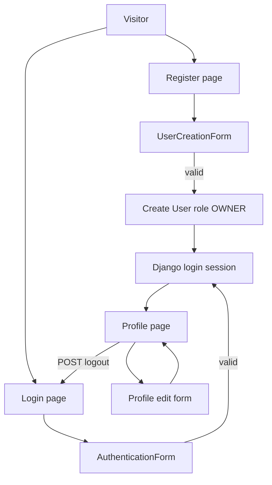

# Plan: Authentication Flow

## Metadata

- Status: IMPLEMENTED
- Related issue: N/A
- Owner: Abdelrahman Atef
- Reviewer: Self-review before implementation; external teammate review required before merge
- Branch: feature/authentication-flow
- Created: 2026-09-25
- Last updated: 2026-09-25

## Objective

Plan public registration, login, POST logout, and authenticated own-profile view and edit for CARVIX using Django's built-in authentication, sessions, password hashing, and CSRF.

Every publicly registered user must receive the existing default role `OWNER`. Privilege fields must be impossible to set from public registration or profile forms. Role-specific dashboards and complete endpoint RBAC remain out of this task.

This document is analysis and planning only. Implementation must not begin while Status is `DRAFT` or Decision is `PENDING`.

## Requirements Covered

From SRS v1.0 (`docs/CARVIX_SRS_Group6.docx`), Document Version 1.0, status "Initial Approved Baseline":

- **FR-01** — visitors register a Vehicle Owner account; the password is hashed. This task plans the public registration form and view. Technician and Administrator signup remain out of scope.
- **FR-02** — registered users log in and log out. Valid credentials create a Django session; logout invalidates it.
- **FR-03** — authenticated users view and update allowed profile fields only.
- **FR-04** — this task assigns the default `OWNER` role on public registration. Endpoint enforcement and role-protected dashboards remain a separate future task.
- **NFR-S01** — profile pages require authentication. Anonymous access redirects to login.
- **NFR-S02** — state-changing browser requests use CSRF protection.
- **NFR-S04** — registration and profile editing must not allow vertical privilege escalation. Complete RBAC for other modules is not claimed.
- **NFR-S07** — validation messages and logs must not expose stack traces, secrets, or sensitive object details.
- **NFR-U02** — forms display clear field-specific validation errors.
- **NFR-M01** — authentication remains in the existing `apps/authentication` application (repository name; SRS theoretically names this `accounts`).
- SRS §6.2 `User` entity: unique username and email; role choices; hashed password.
- UJ-01 expected outcome: authenticated Owner session. The Owner dashboard UI does not exist yet; this plan uses the profile page as a temporary safe destination.
- AGENTS.md §5 step 3 and approved roadmap plan 000 step 3 — authentication and profiles after the custom user model.

## Current-State Analysis

Verified by direct repository inspection on 2026-09-25.

### Completed work already merged into `main`

- PostgreSQL is the only configured database (`django.db.backends.postgresql`).
- Environment secrets are loaded from the local untracked `.env`.
- Custom `User` extends Django `AbstractUser`.
- Username remains the authentication identifier.
- Email is required and unique.
- Approved roles: `OWNER`, `TECHNICIAN`, `ADMINISTRATOR`.
- `OWNER` is the default role.
- The application `role` is independent from `is_staff` and `is_superuser`.
- The initial authentication migration was applied successfully.
- The current available test suite contains 18 tests and passes fully.
- Complete RBAC endpoint enforcement remains a separate future task.

### Authentication application inventory

| Path | Inspection result |
| --- | --- |
| `apps/authentication/apps.py` | Exists. `AuthenticationConfig.name = 'apps.authentication'`. |
| `apps/authentication/models.py` | Exists. `User(AbstractUser)` with `Role` TextChoices, unique `email`, default `role=OWNER`, and `CheckConstraint` `authentication_user_valid_role`. |
| `apps/authentication/admin.py` | Exists. `CustomUserAdmin` exposes `role` in admin only. |
| `apps/authentication/tests.py` | Exists. Eighteen model, hashing, role, settings, and PostgreSQL constraint tests. |
| `apps/authentication/views.py` | Exists as a Django stub only (`render` import; no authentication views). |
| `apps/authentication/migrations/0001_initial.py` | Exists. |
| `apps/authentication/forms.py` | Does not exist. |
| `apps/authentication/urls.py` | Does not exist. |
| `apps/authentication/templates/` | Does not exist. |

### Project routing, settings, and templates

- `config/urls.py` currently routes only `admin/`. No authentication URLs are included.
- `config/settings.py` has `TEMPLATES['DIRS'] = []` and `APP_DIRS = True`. `LOGIN_URL`, `LOGIN_REDIRECT_URL`, and `LOGOUT_REDIRECT_URL` are not set.
- No project-level `templates/` directory and no HTML templates exist, including no `templates/base.html`.
- No other application currently provides a `urls.py`.
- `apps/core` remains a stub and is not listed in `INSTALLED_APPS`. It must not be used as a dashboard destination in this task.

### User fields relevant to public forms

Present on the existing `User` model and `0001_initial` migration:

- Public-safe identity fields: `username`, `email`, `first_name`, `last_name`.
- Password storage: inherited hashed `password` field; hashing must remain Django's standard `UserCreationForm` / `set_password()` behavior.
- Privilege and system fields that public forms must never accept or expose: `role`, `is_staff`, `is_superuser`, `groups`, `user_permissions`, password hash, `last_login`, `date_joined`.

SRS §6.2 lists `id, username, email, password, role, is_active, date_joined`. `first_name` and `last_name` are inherited from `AbstractUser` with `blank=True`. They are allowed as optional public fields. This task must not add model fields.

### Installed Django behavior

The project uses Django 6.1.1. `LogoutView` accepts POST (and OPTIONS) only. GET logout must not be re-enabled. `LoginView` uses Django's redirect mixin, which validates `next` with `url_has_allowed_host_and_scheme`.

### Documentation difference (record only)

SRS NFR-M01 and AGENTS.md theoretically name the auth application `accounts`. The repository uses `apps/authentication`. This task does not rename the application.

## Scope

Plan only the following authentication flow:

1. Public user registration.
2. Login.
3. Logout.
4. Authenticated profile display.
5. Authenticated profile editing.
6. Safe redirects after authentication.
7. Authentication templates.
8. Authentication-flow automated tests.

## Out-of-scope items

Do not include:

- Vehicle models or views
- TechnicianProfile
- Service Types
- Service Slots
- Appointments
- Maintenance Records
- Spare Parts
- Manual booking
- Complete RBAC enforcement
- Ownership checks for vehicles or appointments
- AI tools
- Chat UI
- LLM integration
- API endpoints
- Social login
- Email verification (not required by the approved SRS v1.0)
- Password reset (not required by the approved SRS v1.0)
- Password-change pages in this task (must not be implemented as a profile field; Django Admin remains available)
- Role-specific dashboards
- Frontend framework installation
- Unrelated styling work
- Model changes or new migrations
- Unrelated applications (`core`, `vehicle_management`, `ai_agent`)

## Expected Files

Smallest approved file set based on repository inspection. Do not assume every previously listed candidate must change.

Files expected to be created or modified **after this plan is APPROVED** (nothing is modified now except this plan file):

1. `apps/authentication/forms.py` — create. Registration form and profile edit form.
2. `apps/authentication/views.py` — modify. Replace the stub with registration, profile, and wiring for Django login/logout views.
3. `apps/authentication/urls.py` — create. Named authentication routes.
4. `apps/authentication/tests.py` — modify. Add authentication-flow tests. Keep the existing 18 tests. Do not skip or weaken them.
5. `config/urls.py` — modify. Include the authentication URLconf.
6. `config/settings.py` — modify only for template `DIRS` and authentication redirect settings.
7. `templates/base.html` — create. Required because no base template exists; needed for CSRF tokens, messages, and a shared layout.
8. `templates/authentication/register.html` — create.
9. `templates/authentication/login.html` — create.
10. `templates/authentication/profile.html` — create.
11. `templates/authentication/profile_edit.html` — create.
12. `.agents/plans/003-authentication-flow.md` — this plan.

Files not expected to change in the later implementation of this task:

- `apps/authentication/models.py`
- `apps/authentication/admin.py`
- `apps/authentication/apps.py`
- `apps/authentication/migrations/0001_initial.py`
- other Django applications
- `.env` or environment-variable names

## Registration Design

- Use a subclass of Django `UserCreationForm` bound to the custom `User` model.
- Allowed public fields: `username`, `email`, `first_name`, `last_name`, `password1`, `password2`.
- `username` and `email` are required. `first_name` and `last_name` are optional because the model already allows blank values.
- The registration form and template must never include: `role`, `is_staff`, `is_superuser`, `groups`, `user_permissions`, password hash, `last_login`, `date_joined`.
- Passwords must use Django's standard `UserCreationForm` and password hashing. Do not implement custom password hashing.
- `AUTH_PASSWORD_VALIDATORS` already configured in `config/settings.py` remain in force. Do not weaken them.
- Duplicate username must be rejected by the form.
- Duplicate email must be rejected by explicit form validation (`clean_email` or equivalent). Do not rely only on a later database `IntegrityError` for the user-facing path.
- `save()` must always assign `role=User.Role.OWNER` on the instance and must never read `role` from `cleaned_data`, `request.POST`, the query string, hidden inputs, or the URL.
- Extra submitted privilege fields must be ignored. The created user must remain `OWNER` with `is_staff=False` and `is_superuser=False`.
- After a valid registration, call Django `login()` for the new user so the expected UJ-01 outcome (authenticated Owner session) is met, show a success message, and redirect to the profile page.

## Login and Logout Design

- Prefer Django's built-in authentication system. Do not implement a custom session system.
- Login: `django.contrib.auth.views.LoginView` with Django's `AuthenticationForm` (username and password). Username remains the identifier.
- Set `redirect_authenticated_user=True` on login and registration so already authenticated users are sent away from those pages.
- Invalid login must fail without creating an authenticated session. Do not assume success from frontend behavior.
- Logout: `django.contrib.auth.views.LogoutView` using POST, matching Django 6.1.1. The UI must submit a CSRF-protected POST form. Do not add GET to `http_method_names`.
- Use `django.contrib.messages` for appropriate success and error messages.
- Safe `next` handling and open-redirect prevention must use Django's existing redirect validation.

## Profile Design

- Profile view and profile edit require authentication (`LoginRequiredMixin` or `@login_required`).
- A user may view and update only that same user's profile. Identity comes from `request.user` only.
- Profile URLs must not include a user id or other object identifier (for example `profile/` and `profile/edit/`). This avoids IDOR through a modified URL.
- Profile display may show username, email, first name, last name, and role as read-only information. Do not display the password hash, `is_staff`, `is_superuser`, groups, or permissions.
- Profile edit form allowed fields: `email`, `first_name`, `last_name`.
- Username is not editable. It remains the authentication identifier. Changing it is unnecessary for FR-03 and adds uniqueness and session-identity risk.
- The profile form must never accept: `role`, `is_staff`, `is_superuser`, `groups`, `user_permissions`, password hash.
- Duplicate email on update must be rejected with a field error.
- Password is not a profile field. Password changes are out of this task. If a later task adds them, they must use Django's password-change flow.

## Redirect Strategy

Do not invent dashboards that do not exist yet. Role-aware dashboards are not implemented. The temporary safe existing destination is the authenticated user's own profile page.

This is not a claim that full RBAC enforcement is complete. All roles share the same profile destination until later dashboard work exists.

| Event | Destination |
| --- | --- |
| Registration success | Named URL `authentication:profile` |
| Login success with no `next` or an unsafe `next` | `LOGIN_REDIRECT_URL` → profile |
| Login success with a safe same-origin `next` | that path |
| Logout | `LOGOUT_REDIRECT_URL` → login |
| Profile update success | profile, with a success message |
| Anonymous access to profile pages | login, with a safe `next` back to the requested profile URL |
| Authenticated user visiting registration or login | profile |

Settings to add in `config/settings.py` during implementation:

- `LOGIN_URL = "authentication:login"`
- `LOGIN_REDIRECT_URL = "authentication:profile"`
- `LOGOUT_REDIRECT_URL = "authentication:login"`

Unsafe external `next` values such as `https://evil.example/` must be rejected by Django's redirect validation. The user must remain on an internal CARVIX URL (`LOGIN_REDIRECT_URL`).

Also set `TEMPLATES['DIRS']` to `[BASE_DIR / "templates"]` so project-level templates resolve. No other settings changes are required for this task.

## Security Analysis

- CSRF: `CsrfViewMiddleware` is already enabled. Every POST template (registration, login, logout, profile edit) must include ``. Requests without a valid token must be rejected.
- `login_required` / `LoginRequiredMixin` must protect profile view and edit.
- Safe redirect validation and open-redirect prevention: use Django `LoginView` / redirect mixin behavior. Tests must cover a safe internal `next` and an unsafe external `next` of `https://evil.example/`.
- Privilege-field mass assignment: registration and profile forms must declare an explicit allowed field list. `save()` must not assign `role`, `is_staff`, or `is_superuser` from client input.
- Duplicate email and username validation occurs in forms; unique database constraints remain as defense in depth.
- Password validation uses the existing Django validators. Stored values remain hashed.
- Session handling uses Django sessions only.
- No account role escalation through registration or profile editing.
- Validation messages and logs must not include passwords, hashes, stack traces, or secrets.
- Backend enforcement is required. Hidden inputs, omitted template widgets, or JavaScript must not be the only control.

## Alternatives Considered

### Option A — Django built-in auth views plus explicit forms (recommended)

Use `LoginView` and `LogoutView`, a `UserCreationForm` subclass for registration, and a `ModelForm` for profile editing bound to `request.user`.

- Advantages: smallest secure change; uses Django sessions, CSRF, password hashing, and redirect validation; matches FR-01, FR-02, and FR-03; no custom security-sensitive session code.
- Disadvantages: default Django login is username-based (already approved); no dashboard yet, so redirects go to profile.

### Option B — Custom session and authentication implementation

- Advantages: none for the approved MVP.
- Disadvantages: contradicts the requirement to prefer Django's built-in authentication; higher risk; rejected.

### Option C — Include `django.contrib.auth.urls` wholesale

- Advantages: less URL boilerplate.
- Disadvantages: pulls password reset and password change routes that are out of scope unless the SRS requires them; rejected.

### Option D — Profile URLs with a user primary key

- Advantages: familiar REST-style paths.
- Disadvantages: creates an IDOR surface that this task does not need; rejected.

## Recommended Approach

Option A.

- Create project-level templates and set `TEMPLATES['DIRS']`.
- Registration uses `UserCreationForm`; `save()` forces `OWNER`.
- Auto-login after successful registration; redirect to profile as the dashboard stand-in.
- Profile edit allows `email`, `first_name`, and `last_name` only; username and role are read-only on the profile page.
- Logout is POST-only.
- Add flow tests to `apps/authentication/tests.py` without weakening the existing 18 tests.
- No model change and no new migration.

Why: this satisfies FR-01, FR-02, FR-03, NFR-S01, NFR-S02, and the privilege-escalation portion of NFR-S04 with the least new code, keeps identity on `request.user`, and does not pretend that complete RBAC or dashboards exist.

## Implementation Steps

Do not execute these steps while this plan is DRAFT.

1. Add `TEMPLATES['DIRS'] = [BASE_DIR / "templates"]` and the three authentication redirect settings in `config/settings.py`.
2. Create `apps/authentication/forms.py` with the registration `UserCreationForm` subclass and the profile `ModelForm`.
3. Implement registration and profile views in `apps/authentication/views.py`. Wire login and logout to Django's built-in views.
4. Create `apps/authentication/urls.py` with named routes for register, login, logout, profile, and profile edit.
5. Include those URLs from `config/urls.py`.
6. Create `templates/base.html` and the four authentication templates. Logout must be a CSRF-protected POST form. Already-authenticated users must be redirected away from register and login.
7. Add the Test Plan cases to `apps/authentication/tests.py`. Keep all existing tests.
8. Run `python manage.py check` and expect no issues.
9. Run `python manage.py makemigrations --check` and expect no changes. Do not generate a migration unless an approved model change becomes necessary.
10. Run `python manage.py test apps.authentication` against PostgreSQL.
11. Run `python manage.py test` for the complete available suite against PostgreSQL.
12. Report per AGENTS.md §13. Change this plan to `IMPLEMENTED` only after implementation and required tests are complete.

## Database and Migration Impact

- Model changes are not expected.
- Migrations are not expected.
- No migration should be generated unless an approved model change is necessary.
- PostgreSQL remains the only test database. SQLite must not be used as a fallback.
- No new environment variables.
- No new Python dependencies.
- Rollback after a later implementation, if needed: revert the new forms, views, URLs, templates, tests, `config/urls.py` include, and the settings keys listed above. Do not reverse `authentication.0001_initial`.

## Test Plan

All new tests are database-backed Django test-client tests and must run against PostgreSQL. Inspect existing tests before adding new ones. Never delete, skip, or weaken the existing 18 tests.

### Registration

- Registration page loads.
- Valid registration succeeds.
- Created password is hashed (stored value differs from the raw password; `check_password` succeeds). Do not assert a specific hasher prefix.
- New public user receives `OWNER` role.
- Duplicate username is rejected.
- Duplicate email is rejected.
- Password mismatch is rejected.
- Weak password is rejected according to Django validators.
- `role` is absent from the public registration form.
- `is_staff` is absent.
- `is_superuser` is absent.
- Submitted privilege fields cannot escalate the account (`role`, `is_staff`, `is_superuser` remain unprivileged / `OWNER`).

### Login and logout

- Valid login succeeds.
- Invalid login fails.
- Authenticated user session is created.
- Logout ends the authenticated session.
- GET logout is not allowed under Django 6.1.1 (expected 405).
- Anonymous user cannot access protected profile pages.
- Safe `next` redirect works.
- Unsafe external `next` such as `https://evil.example/` is rejected.

### Profile

- Authenticated user can view the user's own profile.
- Authenticated user can edit approved profile fields.
- Anonymous access redirects to login.
- Profile editing cannot modify `role`.
- Profile editing cannot modify `is_staff`.
- Profile editing cannot modify `is_superuser`.
- Duplicate email update is rejected.

### System validation

- `python manage.py check` passes.
- `python manage.py makemigrations --check` reports no changes.
- Authentication application tests pass.
- Complete available test suite passes on PostgreSQL.

## Open Questions

None blocking. The following decisions are recorded in this DRAFT:

- Username is not editable on the profile form.
- `first_name` and `last_name` are optional on registration.
- Successful registration logs the user in and redirects to profile.
- Profile is the temporary redirect target because role-specific dashboards do not exist.
- Password change, password reset, and email verification are out of this task.

## Approval

- Decision: APPROVED
- Approved by: Abdelrahman Atef
- Approval date: 2026-09-25
- Approval note: Self-approved by the task owner due to the project schedule. External review remains required before merge.

Implementation must not begin while Status is `DRAFT` or Decision is `PENDING`.

## Implementation Report

- Summary:
  - Public registration was implemented.
  - Login was implemented using Django's authentication system.
  - Logout was implemented as POST-only.
  - Authenticated own-profile display was implemented.
  - Authenticated own-profile editing was implemented.
  - Safe internal redirects and external redirect rejection were implemented.
  - Authentication templates were created.
  - Registration forces the `OWNER` role.
  - Public registration cannot set `role`, `is_staff`, or `is_superuser`.
  - Profile editing can modify only email, first name, and last name.
  - Profile identity is obtained from `request.user`.
  - No User model change was made.
  - No migration was created or modified.
  - PostgreSQL remained the only test database.
- Files changed:
  - Created: `apps/authentication/forms.py`
  - Created: `apps/authentication/urls.py`
  - Created: `templates/base.html`
  - Created: `templates/authentication/register.html`
  - Created: `templates/authentication/login.html`
  - Created: `templates/authentication/profile.html`
  - Created: `templates/authentication/profile_edit.html`
  - Modified: `apps/authentication/views.py`
  - Modified: `apps/authentication/tests.py`
  - Modified: `config/settings.py`
  - Modified: `config/urls.py`
  - Modified: `.agents/plans/003-authentication-flow.md`
- Tests executed:
  - `python manage.py check`
  - `python manage.py makemigrations --check`
  - `python manage.py test apps.authentication.tests.RegistrationTests.test_password_mismatch_rejected -v 2`
  - `python manage.py test apps.authentication.tests.RegistrationTests apps.authentication.tests.LoginLogoutTests apps.authentication.tests.ProfileTests -v 2`
  - `python manage.py test apps.authentication -v 2`
  - `python manage.py test -v 2`
- Test results:
  - `python manage.py check`: `System check identified no issues (0 silenced).`
  - `python manage.py makemigrations --check`: `No changes detected`
  - Focused failing-test verification: found 1 test, ran 1 test, passed.
  - Authentication flow test categories: found 41 tests, ran 41 tests, all passed.
  - Complete authentication application suite: found 59 tests, ran 59 tests, all 59 passed. PostgreSQL test database `test_carvix_db` was created, migrations were applied to the test database, and the test database was destroyed successfully.
  - Complete available project suite: found 59 tests, ran 59 tests, all 59 passed. PostgreSQL test database was created and destroyed successfully.
  - Test accounting: existing tests retained: 18; new authentication-flow tests added: 41; total available tests: 59; total passing tests: 59.
- Migration/environment changes:
  - No User model change was made.
  - No migration was created or modified.
  - No environment-variable changes.
  - No new Python dependencies.
  - PostgreSQL remained the only test database. No SQLite fallback was introduced.
- Security checks:
  - Registration uses an explicit public-field allowlist.
  - Public registration forces `OWNER`.
  - Client-submitted role and Django privilege fields cannot escalate the account.
  - Passwords use Django validation and hashing.
  - Logout is POST-only and CSRF-protected.
  - Protected profile pages require authentication.
  - Profile identity comes from `request.user`.
  - Profile editing cannot change username, role, `is_staff`, `is_superuser`, groups, user permissions, or password.
  - Unsafe external redirects are rejected.
  - No secrets or credentials were added.
  - No SQLite fallback was introduced.
- Remaining risks:
  - Complete RBAC endpoint enforcement remains a separate future task.
  - Role-specific dashboards remain a separate future task.
  - Password reset, password change, and email verification remain outside this task.
  - No blocker remains for the approved Authentication Flow task.
- Deviations from plan:
  - The implementation originally reported 44 new tests, but the verified count is 41 new tests and 59 total tests.
  - Five tests initially used an outdated assertFormError calling style and were corrected for Django 6.1.
  - The password-mismatch test was changed to assert the stable `password_mismatch` error code instead of punctuation-sensitive English text.
  - Unused imports were removed.
  - Missing final newlines were added.
  - These are test and formatting corrections, not deviations from the approved functional design.
